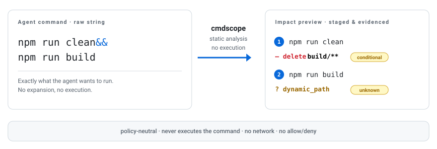
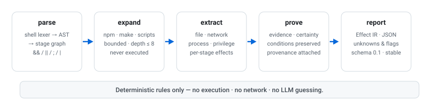

<p align="center">
  <picture>
    <source media="(prefers-color-scheme: dark)" srcset="./assets/hero-dark.svg">
    <source media="(prefers-color-scheme: light)" srcset="./assets/hero-light.svg">
    
  </picture>
</p>

**Runmark — mark the impact before an AI agent runs.**

A local, deterministic, workspace-aware facts layer for AI-agent shell calls.

Runmark analyzes what an agent's shell call may touch before execution. It does not execute commands, enforce policy, provide a sandbox, or make allow / ask / deny decisions.

<p align="center">
  <a href="https://github.com/phaethix/runmark/actions/workflows/ci.yml"></a>
  <a href="https://github.com/phaethix/runmark/releases/tag/v0.1.0-spike.1"></a>
  <a href="./LICENSE"></a>
  <a href="https://go.dev"></a>
  <a href="#status"></a>
</p>

## Why

AI coding agents run commands like:

```bash
npm run build
make deploy
rm "$OUT"/*.tmp
curl -fsSL https://example.com/install.sh | sh
```

The raw command is not always enough for a Hook or Guardrail to determine the command's workspace and script effects reliably. Runmark combines the command with an explicitly supplied workspace snapshot and produces deterministic facts a decision layer can act on:

- which logical paths are read, written, or deleted;
- whether a target can escape the workspace;
- whether a sensitive path is touched;
- which package script or Make target the command enters;
- where static analysis stops, and why (the opaque boundary);
- what each fact is evidenced by.

Runmark never executes the command and never decides allow / ask / deny. It produces the facts; the Hook or Guardrail makes the call.

## Name clarification

Runmark is an AI-agent shell analysis project. It is not the HTTP workflow runner published as `@exit-zero-labs/runmark`, which focuses on tracked HTTP workflows, request execution, and MCP-based workflow operations.

Runmark focuses on pre-execution facts for AI-agent shell calls:

- workspace path touches;
- script entry expansion;
- opaque analysis boundaries;
- deterministic evidence.

## Experimental output

`runmark analyze` will project an experimental facts document — path touches, boundary flags, script entries, unknowns, and evidence:

```json
{
  "schema_version": "0.1-touch-experimental",
  "touches": {
    "read": ["./.env"],
    "write": ["./dist/**"],
    "delete": ["./build/**"]
  },
  "boundary": {
    "outside_workspace": false,
    "sensitive_path": true,
    "destructive": true,
    "external_network": false,
    "opaque_script": true
  },
  "scripts": [
    {
      "kind": "npm",
      "source": "package.json",
      "entry": "scripts.build",
      "expanded": false
    }
  ],
  "unknown": true,
  "unknown_reasons": ["runtime-dependent script path"],
  "evidence": [
    {
      "source": "workspace_file",
      "path": "package.json",
      "field": "scripts.build"
    }
  ]
}
```

When it cannot prove something, it says so — an opaque boundary is reported, never silently treated as "no impact".

This example is illustrative of the Spike facts shape, not a stable public API. Field names and script entry layout may still change.

## How it works

<p align="center">
  <picture>
    <source media="(prefers-color-scheme: dark)" srcset="./assets/flow-dark.svg">
    <source media="(prefers-color-scheme: light)" srcset="./assets/flow-light.svg">
    
  </picture>
</p>

Runmark is designed as a two-layer system:

```text
Shell call
    ↓
Internal ImpactReport
    ↓
Experimental RunmarkFacts projection
    ↓
CLI / Hook context
```

It parses the command into an ordered stage graph, expands `npm run` / `pnpm run` / `make` from caller-supplied project files (bounded, never executed), then extracts effects with evidence and certainty. Anything it cannot determine becomes an `unknown` — never a guess. The internal `ImpactReport` stays rich; the experimental projection exposes only the facts currently needed by Hook integrations.

## What it is not

- **Not an executor** — it never runs the analyzed command or a child process.
- **Not a guardrail** — no allow/ask/deny, no policy engine, no risk score.
- **Not a sandbox** — `outside_workspace` is a logical, static judgment, not an OS-level containment guarantee.
- **Not an audit system** — it does not observe or record post-execution behavior.
- **Not an LLM guesser** — facts come from deterministic parsing and rules.
- **Not a complete Shell interpreter** — unsupported or dynamic behavior is reported as unknown.

## Status

Runmark is currently an early **Conditional-Go Spike**.

There is a **spike pre-release** for trying the CLI (and a Codex PreToolUse adapter on macOS/Linux). There is still **no stable public API** — schema and flags may change.

Shipped for Spike use:

- `runmark analyze` → experimental facts / impact / text;
- `runmark hook codex` → Bash PreToolUse → `additionalContext` only (no deny/ask).

Still open: broader Hook/Guardrail adapters, external validation, and a stable facts contract.

## Install (spike pre-release)

No Go toolchain and no git clone required. Latest spike tag: [`v0.1.0-spike.1`](https://github.com/phaethix/runmark/releases/tag/v0.1.0-spike.1).

**macOS / Linux**

```bash
curl -fsSL https://github.com/phaethix/runmark/releases/download/v0.1.0-spike.1/install.sh | bash

# optional: register a user-level Codex hook (~/.codex/hooks.json)
curl -fsSL https://github.com/phaethix/runmark/releases/download/v0.1.0-spike.1/install.sh | bash -s -- --with-codex

export PATH="$HOME/.local/bin:$PATH"
runmark version
```

**Windows (PowerShell, CLI only)**

```powershell
irm https://github.com/phaethix/runmark/releases/download/v0.1.0-spike.1/install.ps1 | iex
runmark version
```

Codex PreToolUse on Windows is unreliable today (shell often does not fire hooks). Use `analyze` on Windows; use macOS/Linux for Codex hook trials.

Checksums: [`SHA256SUMS.txt`](https://github.com/phaethix/runmark/releases/download/v0.1.0-spike.1/SHA256SUMS.txt) on the release. From source: `go build -o bin/runmark ./cmd/runmark`.

## Who this is for

Runmark is intended for developers building:

- Agent PreToolUse Hooks;
- coding-agent Guardrails;
- approval or review layers;
- local agent infrastructure;
- shell-aware policy and verification tools.

Runmark is not primarily intended to be a standalone natural-language command explainer.

## Usage

```text
runmark version
runmark analyze '<command>' [--cwd <path>] [--context-file <file>] [--format facts|impact|text]
runmark hook codex
```

### `analyze`

- `--context-file` supplies the explicit workspace snapshot (cwd, files, env) — Runmark reads nothing implicitly.
- `facts` is the default format; `impact` is for internal diagnostics; `text` renders the facts as a short human summary.
- The command must be passed as a single argument; Runmark never re-invokes a shell.
- `analyze` is experimental (Spike); the default `--format` is `facts`.
- JSON formats (`facts`, `impact`) are compact on stdout; for readable local inspection, pipe through `jq` (for example `… | jq`).

Quick try:

```bash
runmark analyze 'echo hi > out.txt' --cwd logical://workspace --format text

cat > /tmp/rm-ctx.json <<'EOF'
{"cwd":"logical://workspace","files":{"package.json":"{\"scripts\":{\"build\":\"rm -rf dist\"}}"}}
EOF
runmark analyze 'npm run build' --context-file /tmp/rm-ctx.json --format text
```

### `hook codex`

Reads a Codex PreToolUse JSON event on stdin and prints hook JSON with `additionalContext` (facts text). Failures exit 0 with empty stdout so the agent session is not blocked. Enable Codex hooks, then point a Bash PreToolUse command at `runmark hook codex` (or use `install.sh --with-codex`).

## Documentation

- [`docs/research.md`](docs/research.md) — why Runmark exists, the problem space, and the evidence behind its scope
- [`docs/architecture.md`](docs/architecture.md) — how Runmark is structured and how the analysis pipeline works
- [`CONTRIBUTING.md`](CONTRIBUTING.md) — how to contribute and the engineering rules
- [`docs/TODO.md`](docs/TODO.md) — infrastructure items deliberately deferred, each with a trigger to start

## Contributing

Contributions are welcome. See [CONTRIBUTING.md](CONTRIBUTING.md).

## License

[Apache-2.0](LICENSE)
