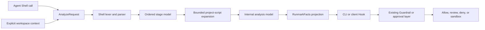
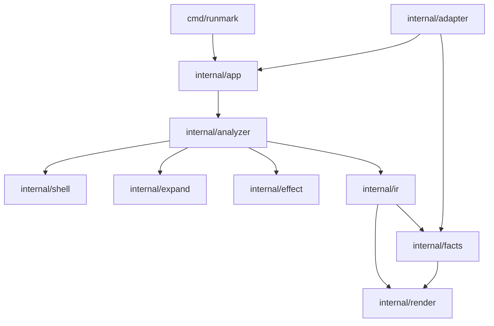

# Runmark architecture

> A public implementation guide for Runmark contributors.

## Architecture goal

Runmark is designed as a local analysis core that can be embedded into an AI-agent Hook or Guardrail.



The core produces facts. The surrounding integration owns policy, approval, sandboxing, and execution.

## Design constraints

The following constraints are part of the architecture:

- The core never executes the analyzed command;
- the core never starts a child process;
- the core never fetches remote content;
- the core does not read the host filesystem implicitly;
- the core does not read the host environment as an undocumented fallback;
- the core does not call an LLM to invent effects;
- every reported fact must have traceable evidence or an explicit aggregate source;
- unknown behavior must remain visible;
- logical path analysis must not be described as operating-system isolation;
- adapters must translate protocols, not reimplement Shell analysis;
- renderers must serialize facts, not infer new facts.

These constraints keep analysis offline, reproducible, and reviewable.

## Repository layout

The current Go project is organized around these responsibilities:

```text
cmd/runmark/              CLI entrypoint
internal/app/             application wiring and command handlers
internal/ir/              internal request/report types and invariants
internal/analyzer/        analysis orchestration and completeness
internal/shell/           lexer, AST, parser, and stage splitting
internal/expand/          bounded npm/pnpm/make/inline-script expansion
internal/effect/          internal effect extraction rules
internal/facts/           internal report to RunmarkFacts projection
internal/render/          JSON and text rendering
internal/adapter/         client-specific Hook adapters
internal/schemacheck/     schema and fixture checks
schema/                   versioned internal and experimental schemas
testdata/                 fixtures and regression cases
```

The intended dependency direction is:



The internal report model should not depend on renderers or client adapters.

## Input model

The core accepts a command and optional, explicitly supplied context:

```go
type AnalyzeRequest struct {
    Command string           `json:"command"`
    Context *AnalysisContext `json:"context,omitempty"`
}

type AnalysisContext struct {
    CWD      string            `json:"cwd"`
    Platform string            `json:"platform,omitempty"`
    Shell    string            `json:"shell,omitempty"`
    Files    map[string]string `json:"files,omitempty"`
    Env      map[string]string `json:"env,omitempty"`
}
```

The context may contain:

- a logical working directory;
- target platform and Shell family;
- read-only contents of files such as `package.json` and `Makefile`;
- explicitly supplied environment values.

The core does not open those files itself. A CLI or adapter may read a context file and pass its decoded contents to the core.

Input boundaries should be validated before analysis:

- command must be non-empty and bounded in size;
- context file keys must be relative workspace paths;
- path traversal in context keys must be rejected;
- context size must be bounded;
- missing context must produce an explicit unknown, not an implicit filesystem read.

## Analysis pipeline

The intended pipeline is grouped into four readable phases:

```mermaid
flowchart LR
    subgraph INPUT[Input]
        direction TB
        V[Validate request] --> N[Normalize paths]
    end

    subgraph PARSE[Parse]
        direction TB
        L[Lex tokens] --> P[Build AST] --> S[Split stages]
    end

    subgraph ANALYZE[Analyze]
        direction TB
        X[Bounded expansion] --> E[Extract effects] --> Q[Evidence and unknowns]
    end

    subgraph OUTPUT[Project]
        direction TB
        C[Completeness] --> R[Validate report] --> F[RunmarkFacts]
    end

    N --> L
    S --> X
    Q --> C

    classDef input fill:#ddf4ff,stroke:#0969da,color:#0b3d91,stroke-width:1px
    classDef parse fill:#fff8c5,stroke:#9a6700,color:#633c00,stroke-width:1px
    classDef analyze fill:#dafbe1,stroke:#1a7f37,color:#116329,stroke-width:1px
    classDef output fill:#fbefff,stroke:#8250df,color:#512a97,stroke-width:1px
    classDef final fill:#ddf4ff,stroke:#0969da,color:#0b3d91,stroke-width:2px

    class V,N input
    class L,P,S parse
    class X,E,Q analyze
    class C,R output
    class F final
```



### Shell structure

The parser should preserve enough structure to reason about:

- quoted words and escapes;
- redirects;
- pipelines;
- `&&`, `||`, and `;`;
- command substitutions;
- inline Shell scripts;
- source locations for evidence.

A compound command is represented as ordered stages. Conditions such as “runs after success” are preserved in the internal model.

### Bounded expansion

Runmark may expand project metadata only when the caller supplies it:

- `npm run` and `pnpm run` read `package.json` scripts;
- `make` reads a supplied Makefile and a limited subset of targets, dependencies, recipes, and literal variables;
- `sh -c` and `bash -c` may parse literal inline Shell strings;
- dynamic Python or interpreter code remains opaque unless it is safely representable by the supported rules.

Expansion is bounded by recursion depth, node count, input size, and the caller's cancellation context. Cycle detection uses the active expansion path, so shared scripts are not confused with recursive cycles.

Runmark never calls `npm`, `pnpm`, `make`, a Shell interpreter, or a remote URL during analysis.

## Internal analysis model

The internal report may contain richer information than the public projection:

```text
ImpactReport
├── command and logical cwd
├── coverage and completeness
├── ordered stages
│   ├── command and condition
│   └── internal effects
│       ├── kind and target
│       ├── certainty and provenance
│       └── evidence
├── structured unknowns
└── derived flags
```

The internal model supports analysis correctness, deterministic tests, and future consumers. It is not automatically a stable public API.

## RunmarkFacts projection

The experimental projection is intentionally smaller:

```json
{
  "schema_version": "0.1-touch-experimental",
  "touches": {
    "read": [],
    "write": [],
    "delete": []
  },
  "boundary": {
    "outside_workspace": false,
    "sensitive_path": false,
    "destructive": false,
    "external_network": false,
    "opaque_script": false
  },
  "scripts": [],
  "unknown": false,
  "unknown_reasons": [],
  "evidence": []
}
```

Projection rules:

- path touches come from internal read/write/delete effects;
- paths are deduplicated and sorted deterministically;
- `outside_workspace` is a logical static judgment, not a sandbox result;
- `sensitive_path` is derived from an explicit, documented sensitive-path rule set;
- `destructive` is a factual action flag, not a risk score;
- network or remote-content effects may set `external_network`;
- blocking unknowns may set `opaque_script` and `unknown`;
- script entries and evidence are retained when available;
- the projection never reparses the command or reads files.

## Unknown and opaque behavior

Runmark must preserve known facts while exposing unknown behavior.

For example:

```bash
curl https://example.com/install.sh | sh
```

The analyzer can report:

```text
network destination: known
interpreter: known
remote script contents: unknown
remote file effects: unknown
```

It must not invent a concrete installation path.

Likewise, if `npm run build` enters a script that depends on a runtime variable, Runmark should retain the known script entry and any proven touches, then mark the remaining behavior as opaque.

## Integration model

A client adapter translates a Hook event into an `AnalyzeRequest`:

```text
Hook event
    ↓
extract Shell command and explicit context
    ↓
Runmark analysis
    ↓
RunmarkFacts
    ↓
short context or structured payload
```

The adapter should:

- handle only the client events it explicitly supports;
- return a deterministic no-op for unsupported events;
- keep stdout valid for the client protocol;
- avoid leaking full commands or sensitive context in diagnostics;
- preserve timeout and cancellation behavior;
- avoid making policy decisions in the core.

The first client adapter should be selected from a currently documented Hook protocol and kept separate from the analyzer implementation.

## Testing strategy

Tests should cover the layers independently:

1. lexer and source spans;
2. parser and AST shape;
3. stage conditions;
4. effect extraction;
5. npm/pnpm/make and inline-script expansion;
6. active-path cycle detection;
7. unknown propagation and completeness;
8. path normalization and deterministic ordering;
9. report validation;
10. RunmarkFacts projection;
11. CLI serialization;
12. adapter input, output, and no-op behavior.

Important regression cases include:

```text
echo hi > output.txt
cat README.md
rm -rf build
rm "$OUT"/*.tmp
npm run build with and without package.json
make deploy with static and dynamic recipes
curl URL | sh
echo $(cat secret.txt)
```

Tests must assert structured facts, unknown codes, evidence, and stable ordering. They should not rely only on a natural-language summary.

## Current implementation status

The repository already contains the main analysis building blocks, including Shell parsing, internal effect rules, unknown primitives, and bounded project-script expansion.

The main remaining engineering work is to connect the existing components into an end-to-end local CLI, add the experimental projection, and validate one real Hook integration. There is no stable public API or installable release yet.

For the rationale behind this scope, see [research.md](research.md). For contribution rules, see [CONTRIBUTING.md](../CONTRIBUTING.md).
